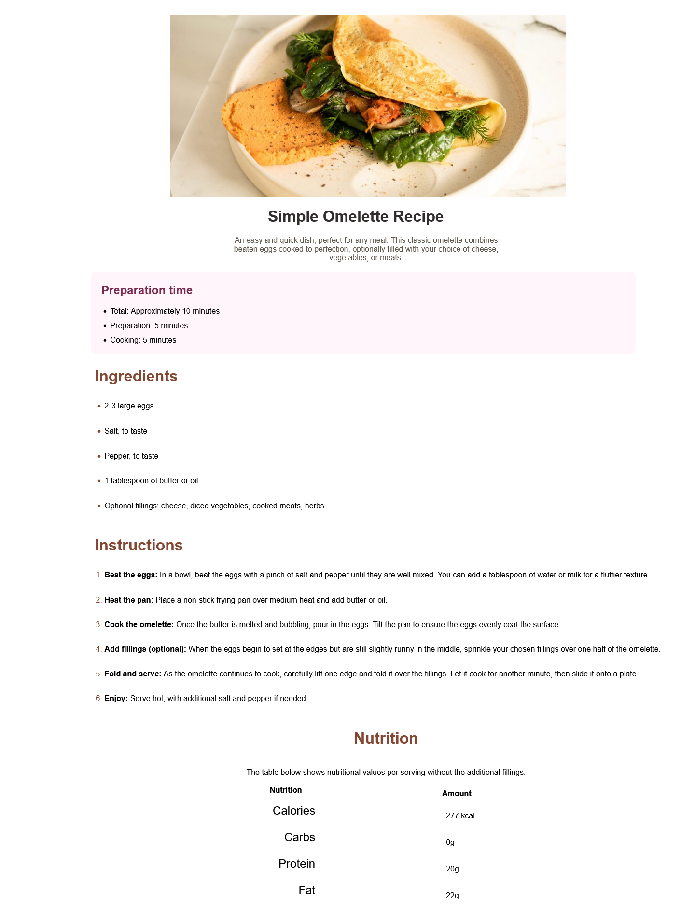

# Frontend Mentor - Recipe page solution

This is a solution to the [Recipe page challenge on Frontend Mentor](https://www.frontendmentor.io/challenges/recipe-page-KiTsR8QQKm). Frontend Mentor challenges help you improve your coding skills by building realistic projects. 

## Table of contents

- [Overview](#overview)
  - [Screenshot](#screenshot)
  - [Links](#links)
  - [Built with](#built-with)
- [Author](#author)

## Overview

### Screenshot

### Links

- Solution URL: [Solution URL](https://github.com/ShaunPour/recipe-page-fcc)
- Live Site URL: [GitHub Pages Live Site](https://shaunpour.github.io/recipe-page-fcc/)

### Built with

- Semantic HTML5 markup
- CSS custom properties
- Flexbox
- Mobile-first workflow

## Author

- Website - [Shaun Pour](https://shaunpour.github.io)
- Frontend Mentor - [@ShaunPour](https://www.frontendmentor.io/profile/ShaunPour)
- LinkedIn - [ShaunPour](https://www.linkedin.com/in/shaun-pour)